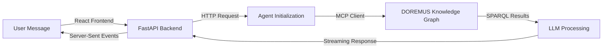

# DOREMUS Chatbot - MCP Integration

A chatbot application that integrates with the **DOREMUS Knowledge Graph** through the **Model Context Protocol (MCP)**, enabling intelligent querying of classical music metadata.

## 🎵 Overview

This project combines a **React frontend** with a **FastAPI backend** to provide an interactive interface for querying the DOREMUS Knowledge Graph—a comprehensive database of classical music information including works, composers, performances, recordings, and instrumentation.

The application uses:

- **LangGraph** for building agentic workflows
- **LangChain** for LLM integration with tool binding
- **Model Context Protocol (MCP)** for structured access to the DOREMUS Knowledge Graph
- **Multiple LLM providers** (OpenAI, Groq, Anthropic, Ollama)

## 📁 Project Structure

```
ChatbotMCP/
├── backend/                    # Python FastAPI backend
│   ├── src/
│   │   ├── server.py          # FastAPI application & HTTP endpoints
│   │   ├── .env               # Environment variables & API keys
│   │   └── agent/
│   │       ├── mcp_testing_agent.py       # Agent initialization & LLM setup
│   │       ├── extended_mcp_client.py     # Custom MCP client wrapper
│   │       ├── prompts.py                 # System prompts & agent instructions
│   │       └── __init__.py
│   ├── pyproject.toml         # Poetry project configuration
│   └── requirements.txt        # Python dependencies
│
├── frontend/                   # React + Vite frontend
│   ├── src/
│   │   ├── App.jsx            # Main React component
│   │   ├── App.css            # Application styles (Tailwind CSS)
│   │   ├── main.jsx           # React entry point
│   │   └── assets/            # Static assets
│   ├── index.html             # HTML template
│   ├── vite.config.js         # Vite configuration
│   ├── tailwind.config.js     # Tailwind CSS configuration
│   ├── package.json           # Node.js dependencies
│   └── public/                # Public static files
│
└── README.md                  # This file
```

## 🚀 How to Setup the server

### Clone the Repo

```bash
git clone https://github.com/d4darius/ChatbotMCP.git
cd ChatbotMCP
```

### Setup the .env variables

Create the file

```bash
nano .env
```

Edit `.env` with your API keys:

```dotenv
OPENAI_API_KEY=sk-...
GROQ_API_KEY=gsk_...
LANGSMITH_API_KEY=lsv2_...
OLLAMA_API_URL="https://mcp-kg-ollama.tools.eurecom.fr"
OLLAMA_API_KEY=...
```

4. **Build the docker container:**

   ```bash
   docker build -t mcp-chatbot-app .
   ```

Then launch it

```bash
   docker run -d \
  --name my-chatbot \
  --restart always \
  -p 8001:8001 \
  --env-file .env \
  mcp-chatbot-app
```

## 🔌 API Endpoints

### `POST /chat`

Send a message to the chatbot and receive streaming responses.

**Request:**

```json
{
  "message": "Find all compositions by Beethoven in the knowledge graph",
  "model": "openai"
}
```

**Response:** Server-Sent Events (SSE) stream with:

- `type: "token"` - Streamed text response from the LLM
- `type: "tool"` - Tool calls (e.g., SPARQL queries generated)

**Query Parameters:**

- `model`: LLM provider (`openai`, `groq`, `anthropic`, `ollama`)

### `GET /`

Returns a welcome message and server status.

## 🤖 How It Works



### Agent Workflow

1. **User Input**: User sends a natural language query via the React frontend
2. **Agent Init**: Backend initializes a LangGraph React agent with:
   - Selected LLM (OpenAI, Groq, Anthropic, or Ollama)
   - MCP tools from DOREMUS Knowledge Graph
   - System prompt with DOREMUS ontology knowledge
3. **Tool Binding**: LLM can call MCP tools to:
   - Explore the DOREMUS ontology
   - Find entity URIs
   - Retrieve entity properties
   - Execute SPARQL queries
4. **Response**: Formatted results returned as a stream to the frontend

## 🛠️ Key Technologies

### Backend

| Technology                 | Purpose                                 |
| -------------------------- | --------------------------------------- |
| **FastAPI**                | REST API framework                      |
| **uvicorn**                | ASGI server                             |
| **LangChain**              | LLM orchestration & tool integration    |
| **LangGraph**              | Agentic workflows (ReAct agent pattern) |
| **langchain-mcp-adapters** | MCP ↔ LangChain compatibility           |
| **mcp**                    | Model Context Protocol implementation   |

### Frontend

| Technology       | Purpose                     |
| ---------------- | --------------------------- |
| **React 19**     | UI framework                |
| **Vite**         | Fast bundler & dev server   |
| **Tailwind CSS** | Utility-first CSS framework |
| **Lucide React** | Icon library                |

## 📊 DOREMUS Knowledge Graph

**DOREMUS** is a comprehensive ontology for classical music metadata based on **CIDOC-CRM** with **FRBR** (Work-Expression-Manifestation-Item) extensions.

### Data Model

- **Work**: Conceptual musical idea (e.g., "Beethoven's 9th Symphony")
- **Expression**: Musical realization with notation, title, composer
- **Manifestation**: Physical recording or publication
- **Item**: Specific instance of a manifestation
- **Event**: Performance or recording event

### Vocabularies

- Musical keys
- Modes
- Genres
- Media of performance
- Thematic catalogs
- Derivation types
- Functions

## 🔑 Environment Variables

| Variable                | Description               | Example                           |
| ----------------------- | ------------------------- | --------------------------------- |
| `OPENAI_API_KEY`        | OpenAI API key            | `sk-...`                          |
| `GROQ_API_KEY`          | Groq API key              | `gsk_...`                         |
| `LANGSMITH_API_KEY`     | LangSmith tracing API key | `lsv2_...`                        |
| `LANGSMITH_PROJECT`     | LangSmith project name    | `rdfMCP_tester`                   |
| `OLLAMA_API_URL`        | Ollama server URL         | `https://...`                     |
| `OLLAMA_API_KEY`        | Ollama authentication     | Base64 encoded                    |
| `LLM_EVAL_PROVIDER`     | Default LLM provider      | `openai`                          |
| `GRAPH_RECURSION_LIMIT` | Agent recursion depth     | `25`                              |
| `DOREMUS_MCP_URL`       | MCP server endpoint       | `https://Doremus.fastmcp.app/mcp` |
| `DOREMUS_MCP_TRANSPORT` | MCP transport protocol    | `streamable_http`                 |

## 🧪 Available LLM Models

| Provider | Model                     | Temperature |
| -------- | ------------------------- | ----------- |
| OpenAI   | `gpt-5.2`                 | 0.0         |
| Groq     | `llama-3.3-70b-versatile` | 0.0         |
| Ollama   | `qwen3-coder:30b`         | 0.0         |

## 📝 Example Queries

- "Find all compositions by Beethoven"
- "What are the different genres in classical music?"
- "Show me recordings of Mozart symphonies"
- "Explore the relationship between works and their performances"

## 📦 Dependencies

### Backend

See [pyproject.toml](backend/pyproject.toml) for complete list:

- Core: `fastapi`, `uvicorn`, `python-dotenv`
- LLM: `langchain`, `langchain-openai`, `langchain-groq`, `langchain-anthropic`, `langchain-ollama`
- Graph: `langgraph`, `langsmith`, `langchain-mcp-adapters`
- LLMs: `openai`, `groq`, `ollama`

### Frontend

See [package.json](frontend/package.json) for complete list:

- Core: `react@19`, `react-dom@19`
- Build: `vite@7`, `autoprefixer`, `postcss`
- Styling: `tailwindcss@3`
- Icons: `lucide-react`

## 📚 Learn More

- [LangChain Documentation](https://python.langchain.com/)
- [LangGraph Documentation](https://langchain-ai.github.io/langgraph/)
- [Model Context Protocol](https://modelcontextprotocol.io/)
- [DOREMUS Project](http://www.doremus.org/)
- [CIDOC-CRM Ontology](http://cidoc-crm.org/)

## 👥 Authors

- **Dario Gosmar** - dario.gosmar@eurecom.fr
- **Simone Fassio** - simone.fassio@eurecom.fr

## 📄 License

This project is part of the DOREMUS initiative. See project repository for license information.

---

**Happy querying! 🎼**
